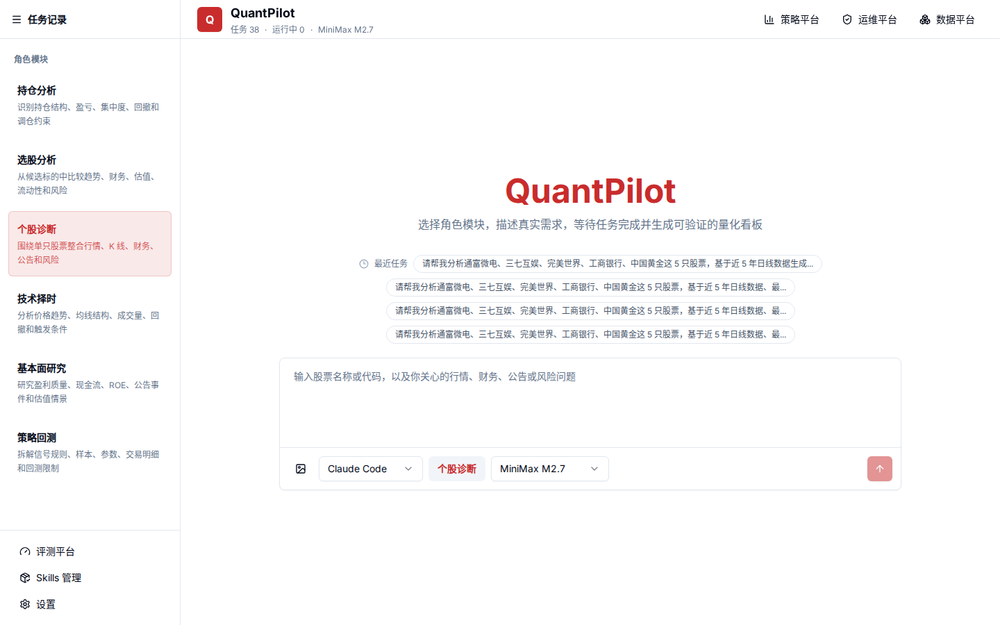

# 01. 本地启动与健康检查

目标：把 QuantPilot 在本地完整跑起来，并确认首页、策略平台、Skills、评测、数据平台和运维平台都能打开。



## 前置条件

- Node.js `>= 20.19.0`
- npm `>= 10`
- Docker / Docker Compose
- Python `3.14`
- uv

## 基础概念

本地运行 QuantPilot 时，其实是在启动四类东西：

| 组件 | 可以理解成 | 负责什么 |
| --- | --- | --- |
| Next.js 主前端 | 产品入口和控制台 | 首页、项目聊天、策略平台、数据平台、运维平台和评测平台 |
| 市场数据后端 | 量化数据 API | 行情、K 线、财务、公告、补数、交易日历和质量扫描 |
| TimescaleDB / PostgreSQL | 事实库 | 保存项目索引、应用状态、股票时序数据、因子、补数任务和策略数据 |
| Redis | 短期缓存 | 缓存行情摘要、板块资金和后续任务进度，不作为长期事实库 |
| Loki / Grafana / Alloy | 可观测性组件 | 收集日志，帮助排查前端、后端、容器和生成链路问题 |

TimescaleDB 不是另一种连接协议，它是预装 TimescaleDB 扩展的 PostgreSQL 镜像。应用仍然通过 `postgresql://...` 连接数据库，只是某些大规模时序表会使用 hypertable 获得更好的写入和查询能力。

QuantPilot 支持降级模式：没有启动市场数据后端或 Loki 时，页面不应该直接崩掉，而是展示内置注册表、本地文件日志或有限兜底数据。本地开发默认使用 `auto`，缺少可选组件只会给 warning。

## 1. 安装前端依赖

```bash
npm install
cp .env.example .env
cp .env.example .env.local
```

需要把 `.env` 或 `.env.local` 里的模型 token 替换成自己的值。真实密钥只放本地，不提交到 Git。

## 2. 启动基础设施

```bash
npm run db:up
npm run db:init
npm run db:doctor
```

`db:up` 会拉起 TimescaleDB 和 Redis。TimescaleDB 本质上是带时序扩展的 PostgreSQL 镜像，用来同时承载普通关系表和量化时序表。

如果需要在运维平台查看集中日志，可继续启动 Loki、Grafana 和 Alloy：

```bash
npm run obs:up
```

不启动这组组件也可以开发，平台会按降级配置读取本地文件日志。

判断这一步是否成功，不要只看命令有没有退出。建议运行：

```bash
npm run db:doctor
npm run doctor
```

`db:doctor` 关注数据库对象是否齐全；`doctor` 关注整个项目运行环境，包括前端、后端、Agent CLI、Skills、评测和降级配置。

## 3. 启动市场数据后端

```bash
cd services/market-data
uv sync --extra baostock --extra akshare
uv run quantpilot-market-api
```

健康检查：

```bash
curl http://127.0.0.1:8000/health
curl "http://127.0.0.1:8000/api/v1/quotes/realtime/600519"
```

## 4. 启动主前端

回到项目根目录：

```bash
npm run dev
```

默认访问：

```text
http://localhost:3000
```

如果 `3000` 被占用，先释放旧进程再启动。主前端应优先保持在 `3000`，生成项目预览会从 `4100` 往后分配端口，`3100` 留给 Loki。

## 5. 页面巡检

打开这些页面确认没有错误覆盖层：

| 页面 | 地址 |
| --- | --- |
| 首页工作台 | `http://localhost:3000` |
| 策略平台 | `http://localhost:3000/strategy-platform` |
| Skills 管理 | `http://localhost:3000/skills` |
| 数据平台 | `http://localhost:3000/data-platform` |
| 运维平台 | `http://localhost:3000/ops-platform` |
| 评测平台 | `http://localhost:3000/eval-platform` |

页面巡检时重点看三件事：

1. 是否出现 Next.js 错误覆盖层。
2. 是否出现空白页、无限加载或明显横向溢出。
3. 页面上的数据是否来自本地后端或明确的降级说明，而不是看起来正常但实际是静态假数据。

## 6. 最小质量门

```bash
npm run lint
npm run type-check
npm run check:skills
npm run check:validation-repair
```

后端：

```bash
cd services/market-data
uv run ruff check .
uv run pytest
```

如果只是改文档，前端类型检查和 lint 仍然值得跑一遍，避免当前工作区已有问题被误以为是文档改动造成的。

## 常见误区

- `docker compose up` 成功不代表数据库 schema 已经齐全，仍需要 `npm run db:init`。
- `localhost:3000` 是主前端，生成工作空间预览端口从 `4100` 开始，`3100` 留给 Loki。
- Redis 缓存可以删除重建，不能把它当作唯一数据来源。
- 离线演示可以用 `QUANTPILOT_DEGRADATION_MODE=offline`，但正式检查应回到 `auto` 或 `strict`。
