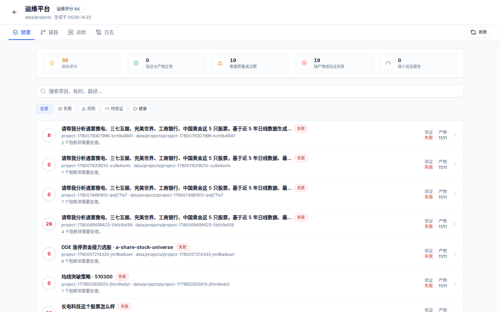
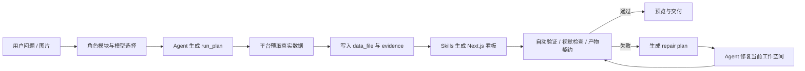

# 02. AI 工作空间生成链路

目标：理解首页的一句话需求如何变成一个可预览、可验证、可修复的生成工作空间。



## 主流程



## 关键产物

每个工作空间通常位于 `data/projects/project-*`，核心产物包括：

| 文件 | 用途 |
| --- | --- |
| `.quantpilot/run_plan.json` | 任务计划、数据需求、预期页面类型 |
| `.quantpilot/events.jsonl` | 生成过程事件流 |
| `.quantpilot/generation-state.json` | 当前生成状态 |
| `.quantpilot/validation.json` | build、HTTP、数据和证据验证结果 |
| `.quantpilot/visual-validation.json` | 截图视觉验收结果 |
| `.quantpilot/validation-repair-plan.json` | 自动修复计划 |
| `data_file/final/dashboard-data.json` | 最终看板数据 |
| `evidence/sources.json` | 数据来源和可追溯证据 |
| `evidence/data_quality.json` | 数据质量、缺失字段、异常和限制 |

详细契约见 [生成工作空间契约](../generated-workspace-contract.md)。

## 生成页面的核心原则

- 页面必须使用真实数据文件，不允许用 mock 或静态样例替换。
- 数据不足时要展示质量说明，不要伪造指标。
- 可视化应根据数据形态选择模板，不应所有任务套同一个页面。
- 移动端和桌面端都要可读，不能横向溢出。
- 验证失败后只修复当前生成工作空间，不改平台代码和数据源。

## 常见页面类型

| 任务类型 | 推荐页面结构 |
| --- | --- |
| 单股诊断 | 顶部摘要、K 线主图、技术指标、财务与事件、风险提示 |
| 多股对比 | 股票矩阵、收益/回撤/波动对比、估值对比、行业和事件差异 |
| 策略回测 | 参数区、净值曲线、回撤、交易列表、风险指标和限制 |
| 板块资金 | 市场资金概览、板块排行、资金趋势、个股贡献和异动说明 |
| 数据质量 | 覆盖率、缺失字段、来源分布、异常点和补数建议 |

## 可选：用 gpt-image-2 辅助流程图

如果需要把上面的 Mermaid 流程转成视觉更强的教学图，可以使用类似提示词：

```text
为 QuantPilot 生成一张横向流程图，风格干净、专业、适合技术文档。
节点包括：用户问题、run_plan、真实数据预取、data_file/evidence、Skills 生成看板、自动验证、失败修复、预览交付。
要求使用浅色背景、蓝绿色强调色、清晰箭头、中文标签，不要出现真实密钥或个人路径。
```

教学文档优先保留真实产品截图；流程图可以作为辅助，不替代真实截图和验证报告。
