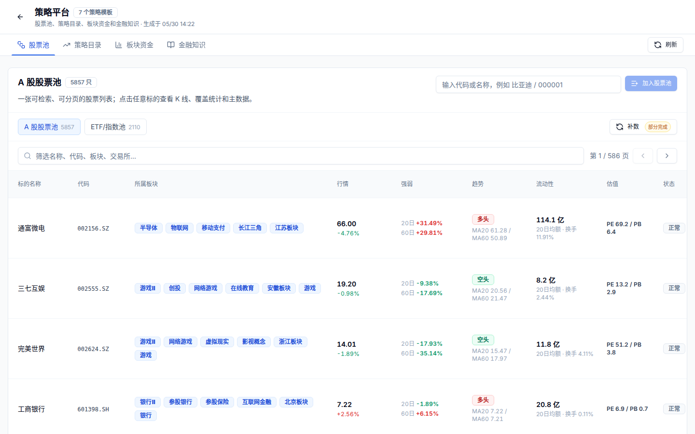

# 03. 市场数据与策略平台

目标：理解 QuantPilot 如何管理股票池、ETF/指数池、K 线、估值因子、板块资金和缓存。



## 数据底座

| 组件 | 责任 |
| --- | --- |
| PostgreSQL | 项目、工作空间、设置、评测、队列、策略元数据 |
| TimescaleDB | `quant.stock_bars`、`quant.stock_factors`、信号和组合快照 |
| Redis | 跨进程短期缓存，优先加速板块资金、行情摘要和后续任务进度 |
| 文件系统 | 生成工作空间源码、截图、证据文件和大 JSON |

TimescaleDB 是 PostgreSQL 的时序扩展镜像，所以连接方式仍然是 PostgreSQL；镜像名称不同，是因为它预装了 TimescaleDB 扩展。

## 数据源策略

当前建议采用多源策略：

1. 东方财富直连：实时行情、分红、公告、证券解析和可达时的历史 K 线。
2. Baostock：A 股历史日线增强字段补数，包括成交额、换手率、停牌、ST、涨跌停和估值。
3. AKShare：作为聚合补充层，用于验证和补充可得字段。
4. Yahoo Finance：只用于海外市场，不作为 A 股主源。
5. 商业源：Wind、Choice、iFinD 等作为未来授权数据源，不混用网页非正式接口。

字段口径和补数规则见 [行情数据源采集知识库](../market-data-source-knowledge.md)。

## 策略平台当前页面

| 区域 | 用途 |
| --- | --- |
| A 股股票池 | 展示股票名称、代码、板块、行情、强弱、趋势、流动性、估值和状态 |
| ETF/指数池 | 从股票池拆出 ETF 和指数，避免与个股混淆 |
| K 线详情 | 点击股票后展开日线、周线、月线，可查看 MA5/10/20/30/60 和动态指标 |
| 策略目录 | 承载策略模板、后续参数配置和回测入口 |
| 板块资金 | 展示市场资金概览、板块资金排行、趋势和详情 |
| 金融知识 | 沉淀字段解释、数据源说明和投资研究口径 |

## 补数字段

`quant.stock_bars` 的高价值字段：

| 字段 | 价值 |
| --- | --- |
| `open/high/low/close` | K 线、趋势、收益和回测基础 |
| `volume` | 成交活跃度 |
| `amount` | 成交额和流动性评分 |
| `turnover` | 换手率 |
| `amplitude` | 当日波动强度 |
| `change_percent/change_amount` | 涨跌幅和涨跌额 |
| `previous_close` | 涨跌停和振幅推导 |
| `trade_status` | 停牌过滤 |
| `is_st` | ST 风险和涨跌停阈值 |
| `limit_up/limit_down` | 涨停/跌停标记 |

`quant.stock_factors` 的高价值字段：

| 字段 | 价值 |
| --- | --- |
| `pe_ttm` | 市盈率 |
| `pb_mrq` | 市净率 |
| `ps_ttm` | 市销率 |
| `pcf_ncf_ttm` | 现金流估值 |

## 批量补数

低频小批次推进，避免一次性打满 5857 只股票：

```bash
curl -X POST 'http://127.0.0.1:8000/api/v1/ingestion/baostock/history/batch' \
  -H 'Content-Type: application/json' \
  -d '{
    "universe_id": "a-share-sample-research-pool",
    "offset": 0,
    "batch_size": 25,
    "period": "daily",
    "adjustment": "qfq",
    "lookback_years": 5,
    "limit": 1260,
    "request_delay_seconds": 1.2
  }'
```

补数规则：只更新同一天同口径记录，不删除已有更早历史；稀疏源不能把已有非空增强字段覆盖成空。

## 性能优化方向

- 列表必须服务端分页，不把全部股票一次性塞给前端。
- 股票池摘要、板块资金和市场资金概览优先走 Redis 短期缓存。
- K 线详情按需加载，点击某只股票再请求明细。
- 资金流详情按板块和时间窗口分层缓存。
- 批量补数任务需要进度页和日志，而不是长时间阻塞一个请求。
