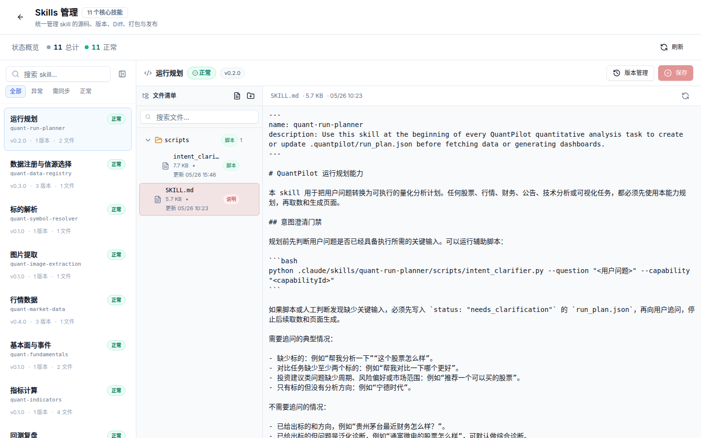

# 04. Skills 与可视化看板

目标：理解 QuantPilot 如何通过 skills 让生成页面更稳定、更好看，并具备自动修复能力。



## Skills 在链路中的位置

Skills 是 Agent 的本地能力包，位于 `.claude/skills/`。它们不只是提示词，也包含领域规则、文件契约、生成约束和修复流程。

常见能力：

| Skill | 用途 |
| --- | --- |
| `quant-run-planner` | 把自然语言问题拆成 run plan |
| `quant-data-registry` | 选择数据源和字段口径 |
| `quant-market-data` | 行情、K 线、实时数据和 provider 规则 |
| `quant-fundamentals` | 财务、估值和公告事件 |
| `quant-indicators` | MA、收益率、回撤、波动率等指标 |
| `quant-visualization-html` | 生成可视化看板和自动修复布局 |
| `quant-data-quality` | 检查缺失字段、来源和数据质量 |

## 管理和发布

| 文件 | 用途 |
| --- | --- |
| `.claude/skills.registry.json` | skills 注册表 |
| `.claude/skills.lock.json` | 当前锁定版本 |
| `.claude/skills.changelog.json` | 版本变更记录 |
| `.claude/skill-packages/*.tgz` | 打包发布产物 |

常用命令：

```bash
npm run check:skills
npm run check:skills:metadata
npm run package:skills
```

## 可视化不应只有一套模板

生成看板应根据数据形态自动匹配模板：

| 数据形态 | 推荐模板 |
| --- | --- |
| 单只股票、完整 K 线 | 单股诊断模板 |
| 多只股票、同一时间窗 | 多股对比矩阵 |
| 因子或指标排名 | 排行榜 + 分布图 |
| 策略回测 | 净值、回撤、交易、参数和限制 |
| 板块资金 | 市场概览、板块排行、趋势和个股贡献 |
| 数据质量检查 | 覆盖率、缺失字段、异常样本和补数建议 |

重点是让生成页面读懂数据结构，而不是把所有任务塞进单股模板。

## 自动修复能力

生成页面失败时，平台会把验证报告、视觉报告和 repair plan 交给 Agent。`quant-visualization-html` 应优先修复：

- `npm run build` 失败。
- 最终数据文件存在但结构没有被页面正确消费。
- 图表过小、只有迷你趋势图、缺少主图。
- 多股票数据被单股模板错误展示。
- 桌面端或移动端横向溢出。
- 卡片、表格、图例、标签互相遮挡。
- 页面使用 mock 数据或丢弃真实数据字段。

修复时只修改当前生成项目目录内的文件，不能回头改平台源码或伪造数据。

## 视觉验收建议

- 桌面端先保证信息密度和扫描效率，再做装饰。
- 金融看板的主图要够宽、坐标轴和日期不能贴到图形上。
- 多股票对比应优先展示矩阵、排行或分组，而不是一屏堆很多小图。
- 重要指标要跟随 hover 日期动态变化。
- 缺失数据要说明原因，不用 `-` 假装可计算。
- 移动端优先保证卡片宽度、图表高度和表格可读性。

截图验收时如果出现 Next 错误页、验证失败页、空白页或明显布局错位，需要先修复再归档截图。
