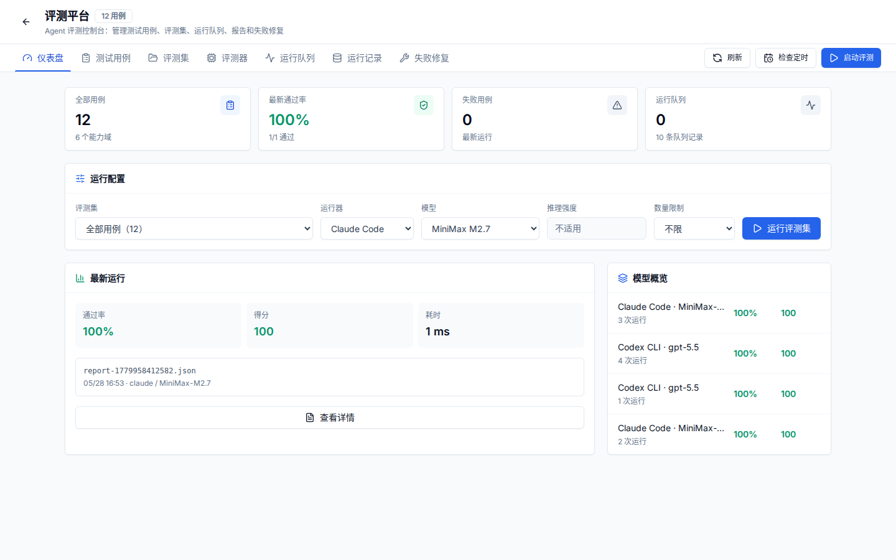

# 05. 评测、运维与质量门

目标：知道如何判断一个生成工作空间是否真的可用，以及失败时从哪里看原因。



## 评测平台

评测平台用于把“生成页面好不好、数据有没有用、能不能自修复”变成可重复检查的任务。

| 模块 | 作用 |
| --- | --- |
| 测试用例 | 单个问题、输入、期望产物和验证规则 |
| 评测集 | 一组测试用例，支持分页和运行管理 |
| 评测器 | dry-run、用例执行、报告生成和失败分类 |
| 运行队列 | 观察等待中、运行中和失败任务 |
| 运行记录 | 保存历史结果、耗时、失败原因和修复建议 |
| 失败修复 | 把验证失败转成可执行 repair plan |

常用命令：

```bash
npm run check:benchmark-coverage
npm run check:eval-schedule
npm run eval:ci
npm run benchmark:quant
```

## 运维平台


运维平台用于查看工作空间健康和生成链路观测。

| 区域 | 关注点 |
| --- | --- |
| 工作空间健康 | 产物是否齐全、验证是否通过、预览是否可访问 |
| 生成链路观测 | 阶段事件、队列状态、trace、错误和耗时 |
| 产物检查 | run plan、data_file、evidence、validation、visual report |
| 修复记录 | repair plan、修复次数、最后失败原因 |

## 最小质量门

平台代码：

```bash
npm run lint
npm run type-check
npm run check:skills
npm run check:validation-repair
```

生成页面：

```bash
npm run check:project-visual
```

首页视觉 smoke：

```bash
npm run check:homepage
```

市场数据后端：

```bash
cd services/market-data
uv run ruff check .
uv run pytest
```

## 常见失败判断

| 现象 | 优先检查 |
| --- | --- |
| 页面显示“看板验证未通过” | `.quantpilot/validation.json` 和 `validation-repair-plan.json` |
| 只有小趋势图，没有主图 | `visual-validation.json` 和可视化 skill 模板匹配 |
| 多股票对比横向溢出 | 页面布局、表格宽度、移动端断点 |
| K 线为空或只剩一天 | `data_file/final/dashboard-data.json` 是否只写入最新日 |
| 成交额/换手率缺失 | `quant.stock_bars` 增强字段和 Baostock 补数状态 |
| 页面编译失败 | 生成项目的 `npm run build` 输出 |

评测和运维不是两个孤立模块：评测负责持续发现问题，运维负责解释单个工作空间为什么失败。
